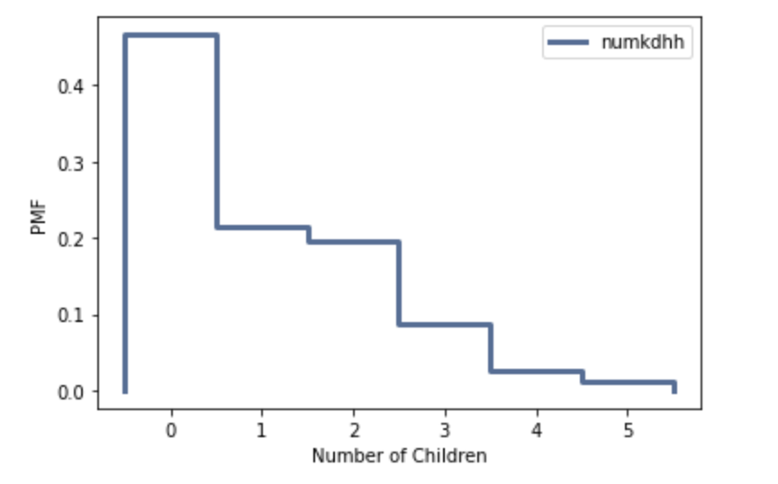
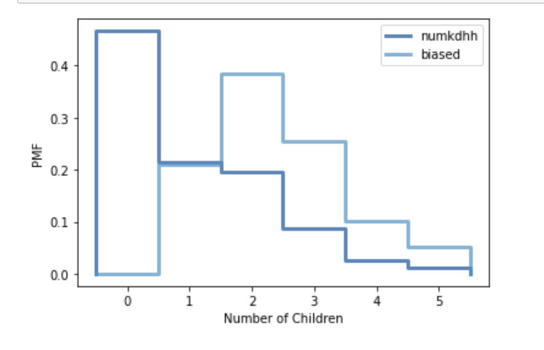

[Think Stats Chapter 3 Exercise 1](http://greenteapress.com/thinkstats2/html/thinkstats2004.html#toc31) (actual vs. biased)

```python
resp = nsfg.ReadFemResp()
pmf = thinkstats2.Pmf(resp.numkdhh, label='numkdhh')
thinkplot.Pmf(pmf)
thinkplot.Config(xlabel='Number of Children', ylabel='PMF')
```
Actual Distribution


```python
biased = BiasPmf(pmf, label='biased')
thinkplot.PrePlot(2)
thinkplot.Pmfs([pmf, biased])
thinkplot.Config(xlabel='Number of Children', ylabel='PMF')
```
Actual and Biased Distribution


```python
pmf.Mean()
```
Actual mean is 1.024205155043831

```python
biased.Mean()
```
Biased mean is 2.403679100664282
