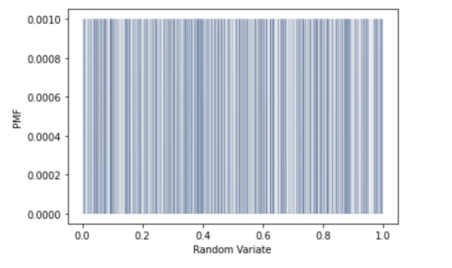
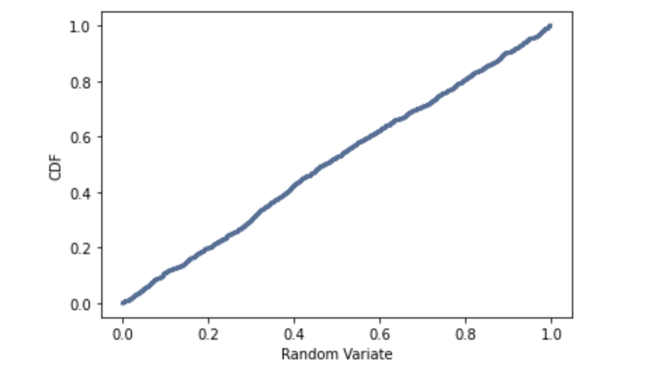

[Think Stats Chapter 4 Exercise 2](http://greenteapress.com/thinkstats2/html/thinkstats2005.html#toc41) (a random distribution)

Generate 1000 numbers from numpy.random.random and Plot
------------

```python
t = np.random.random(1000)
```
##Plots
```python
pmf = thinkstats2.Pmf(t)
thinkplot.Pmf(pmf, linewidth=0.1)
thinkplot.Config(xlabel='Random Variate', ylabel='PMF')
```
**PMF Plot**


There are too many values to use the PMF plot

```python
cdf = thinkstats2.Cdf(t)
thinkplot.Cdf(cdf)
thinkplot.Config(xlabel='Random Variate', ylabel='CDF')
```
**CDF Plot**


The CDF is a straight line so the distribution is uniform.
